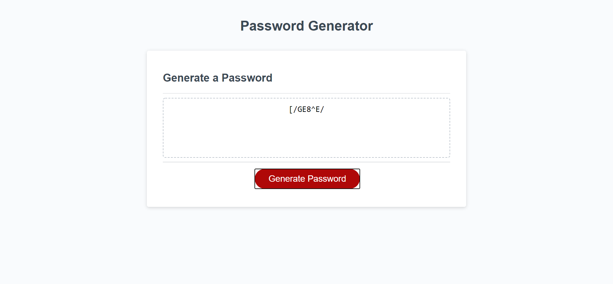

# randomPasswordGenerator

[Random Password Generator ](https://ewager1.github.io/randomPasswordGenerator/)

## Goal

To create a password generator with the following criteria:

- generates random password
- user may choose character length from 8-128 characters
- user may choose any or all of the following character types
  1. uppercase characters
  2. lowercase characters
  3. numeric characters
  4. special characters

## Outcome

-Password achieves each of the prerequisits

## Concepts learned

This was my first Javascript project. I was given starting html and an event listener, but wrote out the rest
of the logic myself. There were a lot of "rabbit holes" I jumped down be able to complete this concept. Some of the
major areas I learned more about was:

- a deeper understanding of scope
- using objects when i need to pass along multiple values to future functions
- naming variables clearly for my fuature self and other programmers
